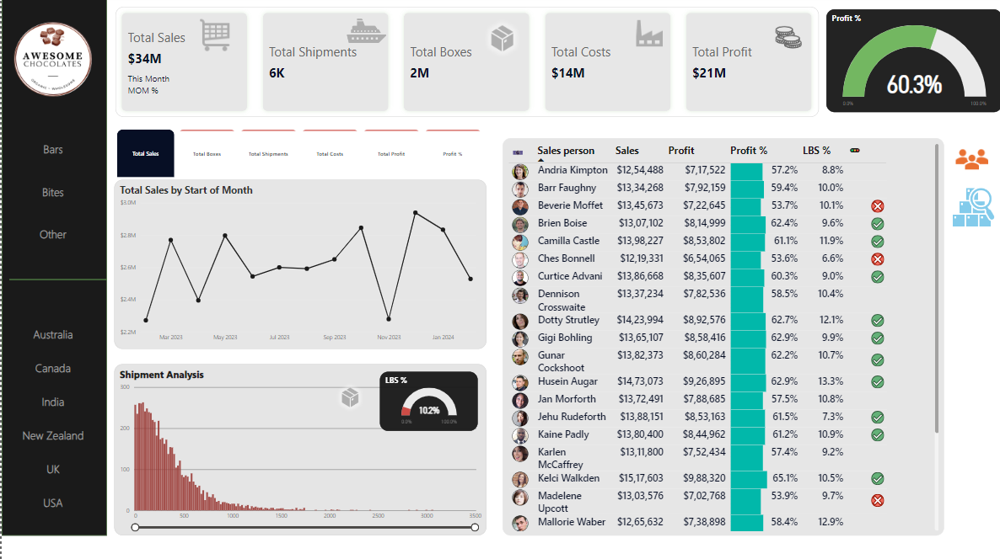

# Power_BI
Awesome Chocolates Sales Dashboard

translating raw sales data into decisions a sales manager could actually act on.

## Business Context

As someone moving from a sales background into data analytics, I wanted a project that combined both: taking a raw sales dataset and turning it into a dashboard a sales team could use to spot underperforming regions, products, and reps — not just a chart for its own sake.

## What the Dashboard Covers

- **Sales performance by region and country** — identifying which markets are over/under-performing
- **Product-level breakdown** — best and worst-selling chocolate products by revenue and volume
- **Sales rep performance** — individual contribution to total revenue
- **Time trends** — monthly/quarterly sales patterns

## Approach

- Imported and modeled raw sales data in Power BI (data cleaning and relationships via Power Query)
- Built DAX measures for revenue, growth, and rep performance metrics
- Designed the report for at-a-glance readability — KPI cards up top, drill-down detail below

## Key Finding

*(Add your actual top-line insight here — e.g., "X region accounted for Y% of total revenue despite only Z% of sales reps" or "Top 3 products drove nearly half of total revenue.")*

## Tools

Power BI · Power Query · DAX

## Notes

Self-directed project built while transitioning from a sales background into data analytics.

